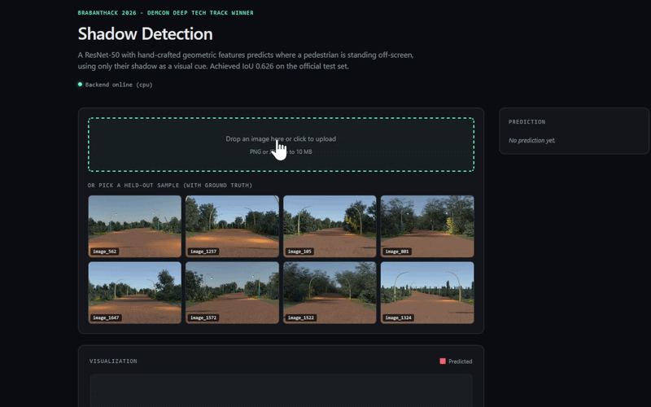

# Shadow Detection


> Predicting off-screen pedestrian locations from shadow imagery.
> Winning solution for the **BrabantHack 2026 DEMCON Deep Tech track** with **IoU 0.626** on the official test set.

The task: given a single 720x480 image of a road scene where a pedestrian is *not visible in frame* but their shadow is, predict the off-screen bounding box where the pedestrian would be standing.

This repository contains a runnable demo plus the full training pipeline.



## Quick start

> **Prerequisites.** You must have **Python 3.10+** and **Node.js 20+** installed and on your PATH *before* running the launch script. These are not auto-installed. Everything else (uv, Python dependencies, npm dependencies, and the trained model) is set up automatically on first run.
>
> - Python: https://www.python.org/downloads/
> - Node.js (LTS): https://nodejs.org/

**Linux / macOS:**

```bash
git clone https://github.com/filipp-lotsmanov/shadow-detection.git
cd shadow-detection
chmod +x run.sh
./run.sh
```

**Windows (PowerShell):**

```powershell
git clone https://github.com/filipp-lotsmanov/shadow-detection.git
cd shadow-detection
Set-ExecutionPolicy -Scope Process -ExecutionPolicy Bypass
.\run.ps1
```

First run downloads the trained model (~50 MB) and installs dependencies (~500 MB), so it takes 3-5 minutes. Subsequent runs start in seconds. When ready, open `http://localhost:3000` in your browser.

## What you'll see

A demo page where you can either upload your own shadow image or pick from 8 bundled held-out samples (which have ground-truth bounding boxes for comparison). The page renders:

- The input image with the predicted bounding box overlay (red), and the ground-truth bbox (green) if the sample has one
- Side classification (left vs right of frame) with confidence
- Direction classification (walking into / out of frame) with confidence, or abstention
- Predicted bbox coordinates, image dimensions, inference latency

## Approach

### Key architectural decision: decomposed bbox prediction

Rather than regressing raw `[xmin, ymin, xmax, ymax]` coordinates, the bounding box is decomposed into:

- `side`: classification (left vs right of frame)
- `distance_from_edge`: regression (always positive)
- `bbox_width`, `bbox_height`: regression
- `y_center`: regression

This was motivated by EDA: the x-coordinate distribution is bimodal (people are always either left or right of the frame), creating a discontinuity that's hard for a single regressor to model. The dedicated side classifier handles the discontinuity, leaving the regressor to learn simpler continuous offsets.

### Architecture

```
       Image (3, 384, 384)              19 geometric features
              |                                 |
              v                                 |
       ResNet-50 backbone                       |
       (ImageNet-pretrained)                    |
              |                                 |
              v                                 |
       2048-d image features <-----[concat]----+
              |
              v
       Linear(2067 -> 512) + BatchNorm + ReLU + Dropout
              |
       +------+------+------+
       |             |      |
       v             v      v
    side head    reg head   direction head
    (2 logits)   (4 dims)   (2 logits)
```

### The 19 geometric features

Computed from each raw image and concatenated with the ResNet features. These were the largest single improvement during the hackathon - adding them lifted IoU from ~0.57 to ~0.62.

- LAB-colorspace shadow mask + density on the road region
- Shadow centroid (x, y) and spread (std_x, std_y)
- Left/right mass ratio
- Column-density argmax and weighted mean
- Left/right edge-strip density (30 px)
- PCA principal axis angle of the shadow blob
- Sobel edge-response mean and 90th percentile
- Bottom-strip intensities and ratio (left/right corners)

The features are mirrored when the image is horizontally flipped during augmentation.

### Iteration story

| Stage | Change | Approx. IoU |
|---|---|---|
| Baseline | ResNet-50 + 3-head decomposed regression | ~0.52 |
| + Augmentation | Horizontal flip with side-label mirroring, larger input | ~0.57 |
| + Geo features (final) | 19 hand-crafted features alongside ResNet | **0.626** |

### Inference (production)

Each request runs the model on the original image and its horizontal flip (test-time augmentation). Softmax outputs are averaged with reversed class indices for the flipped pass, and regression outputs are averaged across orientations. Direction reports `-1` (abstain) when peak confidence falls below 0.6.

The deployed model is a single TorchScript-traced ResNet-50 (~50 MB).

## Repository layout

```
shadow-detection/
+-- backend/                       FastAPI inference server
|   +-- app/
|   |   +-- __init__.py
|   |   +-- main.py                HTTP routes, CORS, model loading
|   |   +-- inference.py           TorchScript model, TTA, bbox reconstruction
|   |   +-- features.py            19 geometric features (matches training-time impl)
|   |   +-- schemas.py             Pydantic request/response models
|   +-- models/                    Populated at runtime from GitHub releases (model.pt + target_stats.json)
|   +-- pyproject.toml             CPU PyTorch + FastAPI deps
+-- frontend/                      Next.js 15 (App Router, JavaScript, CSS modules)
|   +-- app/
|   |   +-- page.js                Main orchestration
|   |   +-- page.module.css
|   |   +-- layout.js
|   |   +-- globals.css
|   +-- components/
|   |   +-- ImageUploader.js       Drag-drop + sample gallery
|   |   +-- ImageUploader.module.css
|   |   +-- PredictionViewer.js    Canvas-based bbox overlay
|   |   +-- PredictionViewer.module.css
|   |   +-- PredictionStats.js     Side panel with classification stats
|   |   +-- PredictionStats.module.css
|   +-- public/samples/            8 demo images + samples.json (ground-truth manifest)
|   +-- package.json
|   +-- package-lock.json
|   +-- next.config.js
|   +-- jsconfig.json
|   +-- .env.local.example
+-- training/                      Full training pipeline (Hydra-configured)
|   +-- src/shadow_detection/      PyTorch package
|   |   +-- __init__.py
|   |   +-- data.py                Annotation loading + target decomposition
|   |   +-- dataset.py             Dataset + augmentation
|   |   +-- features.py            19 geometric features
|   |   +-- model.py               ResNet-50 + 3-head architecture
|   |   +-- losses.py
|   |   +-- metrics.py
|   |   +-- gpu.py                 Free-GPU selection
|   |   +-- runtime.py             Device / AMP / DataLoader helpers
|   +-- scripts/
|   |   +-- train.py               Training entry point
|   |   +-- export_model.py        Checkpoint -> TorchScript for deployment
|   |   +-- build_samples.py       Regenerate the demo gallery (maintainer tool)
|   +-- configs/                   Hydra YAML configs (config, data, model, training)
|   +-- setup.sh / setup.ps1       Environment setup (GPU autodetect, CPU fallback)
|   +-- pyproject.toml             CUDA PyTorch deps
|   +-- README.md                  Training-specific documentation
+-- docs/
|   +-- demo.gif                   Demo preview shown above
+-- run.sh                         One-command launcher (Linux/macOS)
+-- run.ps1                        One-command launcher (Windows)
+-- LICENSE                        MIT
+-- README.md
```

## API

`POST /predict` accepts a multipart image file and returns:

```json
{
  "bbox": { "xmin": -82.4, "ymin": 213.1, "xmax": 18.7, "ymax": 412.5 },
  "side": 0,
  "side_confidence": 0.998,
  "direction": 1,
  "direction_confidence": 0.74,
  "image_width": 720,
  "image_height": 480,
  "inference_ms": 142.3
}
```

`side`: `0` = off-screen left, `1` = off-screen right.
`direction`: `0` = walking out of frame, `1` = walking into frame, `-1` = abstain.

Full OpenAPI docs at `/docs` once the backend is running.

## Reproducing the training

The trained model is bundled via GitHub releases so reviewers don't need a GPU to run the demo. If you want to retrain from scratch, the full training pipeline is in `training/` - see `training/README.md` for details. Training takes ~11 minutes on an NVIDIA L40S and is impractical without a CUDA GPU.

## Team

The winning hackathon submission was a joint effort with Oleksii Krasnoshtanov and Danil Sysenko. The 3-head decomposed-target architecture, 19 hand-crafted geometric features, flip-aware augmentation, and TTA inference were my contributions. Danil and Oleksii ran complementary models in parallel; the original hackathon submission was a weighted blend of all of our individual best results.

## Limitations

A few honest caveats about what this model can and cannot do:

- **Direction prediction is unreliable.** The side classifier (left/right of frame) is effectively solved at ~100% accuracy, and bounding-box regression is strong, but the "walking into vs out of frame" head only reaches 65-70% at its best and often sits in the 50-60% range. Shadow shape carries weak signal about walking direction, so this output should be treated as a low-confidence hint rather than a reliable prediction. The inference path abstains (returns `-1`) below a confidence threshold for this reason.
- **Trained and evaluated on synthetic data only.** The entire dataset is computer-generated. The model has never seen a real photograph, and real-world generalization is untested. Lighting, shadow softness, ground textures, and camera characteristics in real scenes differ from the synthetic distribution in ways that would likely degrade performance.
- **No held-out ground-truth test set.** The IoU 0.626 figure comes from the competition leaderboard, which scored a hidden test set. Locally there is no ground-truth test split, so internal validation during the hackathon was indirect (via leaderboard submissions). The model trains on all available annotated samples.
